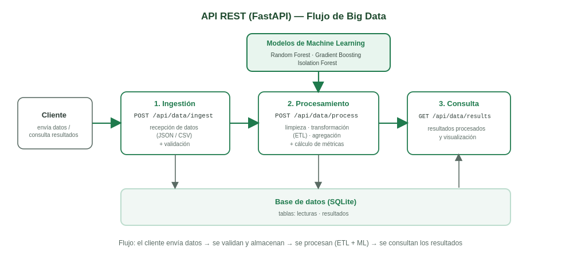

# API de Pipeline de Datos con Machine Learning — Invernadero Inteligente

API REST que cubre el **flujo completo de Big Data** —ingestión, procesamiento y consulta—
de los datos ambientales del invernadero del **Colegio Club de Leones**, con análisis mediante
**Machine Learning**. Proyecto de la materia **Tecnologías Emergentes I** (UNIVALLE).

---

## Flujo del pipeline

1. **Ingestión** (`POST /api/data/ingest`) — recibe lecturas (JSON o CSV), las **valida** y las almacena.
2. **Procesamiento** (`POST /api/data/process`) — **limpia, transforma (ETL) y agrega** los datos, y calcula métricas (incluida la detección de anomalías con ML).
3. **Consulta** (`GET /api/data/results`) — devuelve los **resultados procesados** para su visualización.

Adicionalmente expone endpoints de **Machine Learning** (predicción de temperatura y detección de anomalías).

## Arquitectura



## Estructura del proyecto

```
invernadero-data-api/
├── app/
│   ├── main.py                 # Aplicación FastAPI (punto de entrada)
│   ├── api/                    # Endpoints (routers)
│   │   ├── data.py             #   ingestión, procesamiento, consulta
│   │   └── ml.py               #   predicción y anomalías
│   ├── core/                   # Configuración y base de datos
│   │   ├── config.py
│   │   └── database.py
│   ├── models/                 # Tablas y modelos entrenados
│   │   ├── tablas.py
│   │   └── saved_models/       #   .joblib + metrics.json
│   ├── schemas/                # Validación de datos (Pydantic)
│   └── services/               # Lógica de negocio
│       ├── data_service.py
│       └── ml_service.py
├── scripts/
│   ├── entrenar_modelos.py     # entrena y evalúa los modelos
│   └── benchmark.py            # mide las métricas de rendimiento
├── data/                       # dataset simulado
├── REPORTE_METRICAS.md         # reporte de métricas obtenidas
├── requirements.txt
└── README.md
```

## Requisitos

- Python 3.9 o superior

## Instalación y ejecución

```bash
# 1. Clonar el repositorio
git clone https://github.com/USUARIO/invernadero-data-api.git
cd invernadero-data-api

# 2. (Recomendado) Crear y activar un entorno virtual
python -m venv venv
venv\Scripts\activate        # Windows

# 3. Instalar las dependencias
python -m pip install -r requirements.txt

# 4. (Opcional) Entrenar los modelos y generar metrics.json
python scripts/entrenar_modelos.py

# 5. Iniciar el API
python -m uvicorn app.main:app --reload
```

Documentación interactiva (Swagger UI): **http://127.0.0.1:8000/docs**

## Endpoints

### Flujo de datos

| Método y ruta | Función |
|---|---|
| `POST /api/data/ingest` | Recibe y valida lecturas (JSON), las almacena |
| `POST /api/data/ingest/csv` | Ingestión masiva desde el dataset CSV |
| `POST /api/data/process` | Limpieza, transformación (ETL) y agregación |
| `GET /api/data/results` | Consulta los resultados procesados |

**Ejemplo — ingestión:**
```bash
curl -X POST "http://127.0.0.1:8000/api/data/ingest" \
     -H "Content-Type: application/json" \
     -d '{"temperatura": 18.4, "humedad": 62, "luminosidad": 540}'
```
Respuesta:
```json
{ "recibidos": 1, "validos": 1, "rechazados": 0, "mensaje": "1 lecturas válidas almacenadas; 0 rechazadas por validación." }
```

### Machine Learning

| Método y ruta | Función |
|---|---|
| `POST /api/ml/predecir` | Predice la temperatura de la próxima hora |
| `POST /api/ml/detectar-anomalia` | Detecta si una lectura es anómala |

## Métricas obtenidas

| Métrica | Resultado | Objetivo |
|---|---|---|
| Tiempo de respuesta | < 15 ms (máx.) | < 200 ms ✓ |
| Validación de datos | 99,17 % | > 98 % ✓ |
| Procesamiento correcto | 100 % | > 98 % ✓ |
| Tasa de error | 0 % | < 1 % ✓ |

Detalle completo en [`REPORTE_METRICAS.md`](REPORTE_METRICAS.md). Reproducible con `python scripts/benchmark.py`.

## Autores

Proyecto grupal — Tecnologías Emergentes I, Universidad Privada del Valle (UNIVALLE).

-Saul Alessander Chipana Bautista

-Alex Michael Loza Donaldson 

-Jose Ignacio De La Barra Urquieta

-Javier Morales Gutierrez
